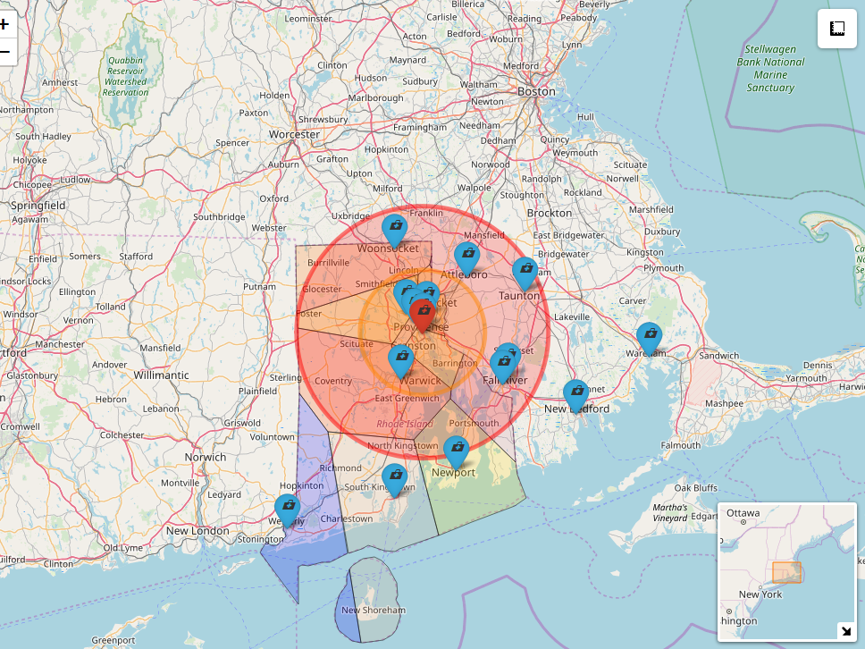

# RhodeIsland
Voronoi map of hospitals providing stroke services in Rhode Island, USA. The Voronoi map is written such that any point within each voronoi (colored) cell is closest to the seed (hospital). It illustrates the points that large change to the system is required to improve delivery of stroke care. In this map, some hospitals are closer to counties in adjacent states. Also if patients are transported to the nearest hospital, then a lot of cases would have been taken to adjacent Primary Stroke Centre (PSC) rather than the Comprehensive Stroke Centre (CSC). PSC can provide clot busting therapy whereas CSC are capable of providing clot busting and clot extraction (thrombectomy). Uses deldir to create voronoi, and awesome icons for markers, ggmap for geocoding, leaflet for making map. new ggmap users should obtain key from Google Maps API. The shape file comes from [tiger 2019 data](https://www.census.gov/geographies/mapping-files/time-series/geo/tiger-line-file.html). The code is provided in [Rmd](./index.Rmd) file, geocode data on hospitals in Rhode Island is provided in [excel file](./Rhode.xlsx). 

The interactive map can be accessed here . The [online codes](https://richardbeare.github.io/GeospatialStroke/) and [tutorial paper](https://www.frontiersin.org/articles/10.3389/fneur.2019.00743/full) for creating map of catchment is available online. This repository is linked to a paper published in the journal of Stroke [paper](https://www.ahajournals.org/doi/10.1161/STROKEAHA.119.026735). A related map on stroke hospitals affiliated with Get With The Guidelines in USA is available [here](https://gntem2.github.io/GWTG_Stroke_Hospitals/). Please note that this map only contains hospitals affiliated with Get With The Guidelines. 

